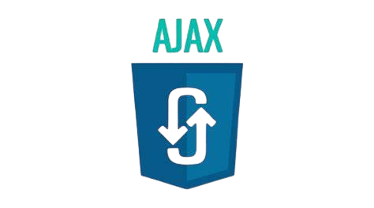

# Welcome to My Profile! 👋

  

<h2 align="center">
I'm a Full-Stack Web Developer 💻
</h2> 

I am passionate about logical thinking and the process of finding multiple solutions to a problem to discover the best one. I thrive on the challenge of developing creative websites, where I apply my analytical skills to craft efficient and innovative solutions.

## 👩‍💻 About Me

I'm a passionate Computer Engineering graduate from Birzeit University, on a perpetual journey of learning and innovation. Currently enrolled in a course at Axsos Academy, I'm expanding my skill set and exploring new horizons in technology.

## 💼 Technical Skills

My expertise lies in crafting robust solutions using a variety of programming languages and technologies, including:

### Languages

### Tools

### Databases

### Frameworks/Libraries

These tools empower me to turn ideas into reality and solve complex problems elegantly and efficiently. 

## 🌱 I'm currently learning

- MongoDB
- Express.js
- React
- Node.js

## 🤝 Get in Touch

I'm always excited to connect with fellow enthusiasts, collaborate on projects, or chat about the latest tech trends. Feel free to reach out via:

 
- 💬 If you have any questions/feedback, please do not hesitate to reach out to me!
 
- Let's build something amazing together! 💡

## 📈 GitHub Stats 

