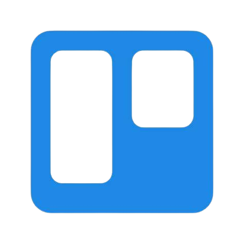

<h1 align="center">
Hi, I'm Rand Farhoud
  </h1>

  

<h2>👩‍💻 About Me</h2>

 <ul>
      <li>🎓 I'm a passionate Computer Engineering graduate from Birzeit University and a proud graduate of AXSOS Academy, on a perpetual journey of learning and innovation.</li>
      <li>👥 I love working in teams and collaborating on projects.</li>
      <li>👩‍🏫 I'm passionate about helping people in tech and enjoy teaching.</li>
      <li>🐾 I'm an animal lover and have worked on pet adoption platforms.</li>
      <li>💻 I enjoy building creative projects.</li>
      <li>🎯 I focus on writing clean, detailed code with attention to styling and structure.</li>
      <li>💡 I enjoy tackling complex coding challenges across different tech stacks.</li>
</ul>

## 💼 Technical Skills

My expertise lies in crafting robust solutions using a variety of programming languages and technologies, including:

### Languages

### Tools

### Databases

### Frameworks/Libraries

These tools empower me to turn ideas into reality and solve complex problems elegantly and efficiently. 

## 🌱 I'm currently learning

- MongoDB
- Express.js
- React
- Node.js

## 🚀 Projects & Achievements
Over the years, I've had the opportunity to work on some exciting projects, each of which helped me sharpen my skills and solve unique problems. Here’s a glimpse of what I’ve been working on:

### 🔗 [LinkUp](https://github.com/mustafataha5/LinkUp)

### 🐾 [SOAR (Support Our Adoption Rescue)](https://github.com/SaidQT/SOAR)

### 📚 [KidsWorld](https://github.com/Farhoud-Rand/KidsWorld)

### 🚗 [ParkRamallah](https://github.com/Farhoud-Rand/ParkRamallah)

## 🤝 Get in Touch

I'm always excited to connect with fellow enthusiasts, collaborate on projects, or chat about the latest tech trends. Feel free to reach out via:

 
- 💬 If you have any questions/feedback, please do not hesitate to reach out to me!
 
- Let's build something amazing together! 💡

## 📈 GitHub Stats & Activity

  
  

